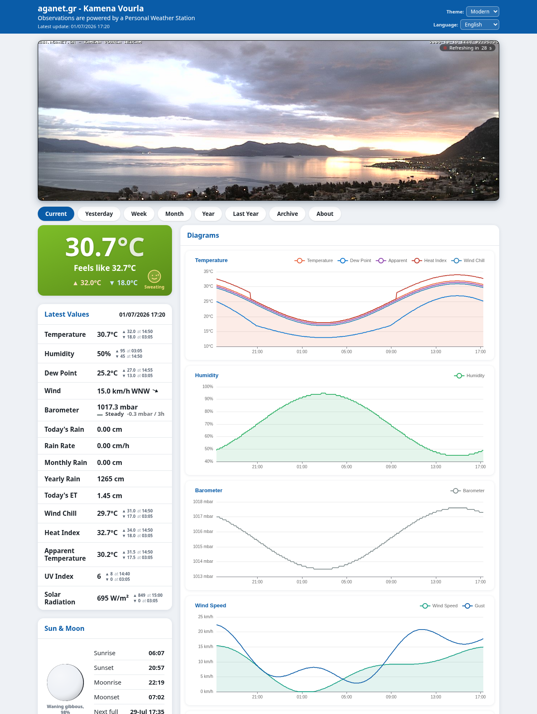
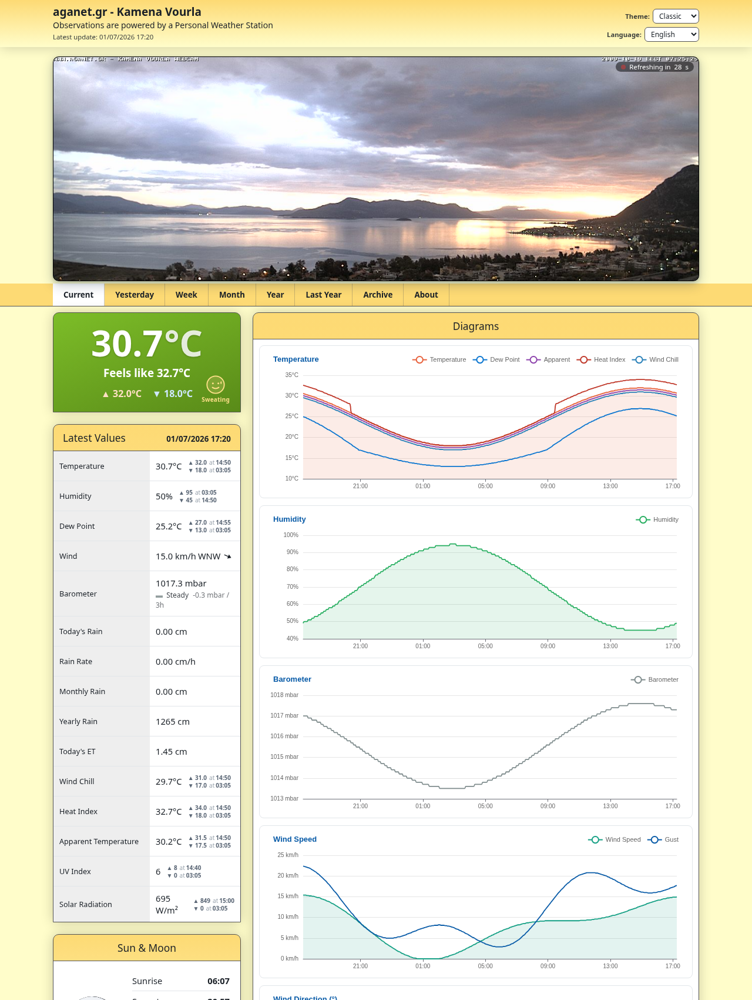
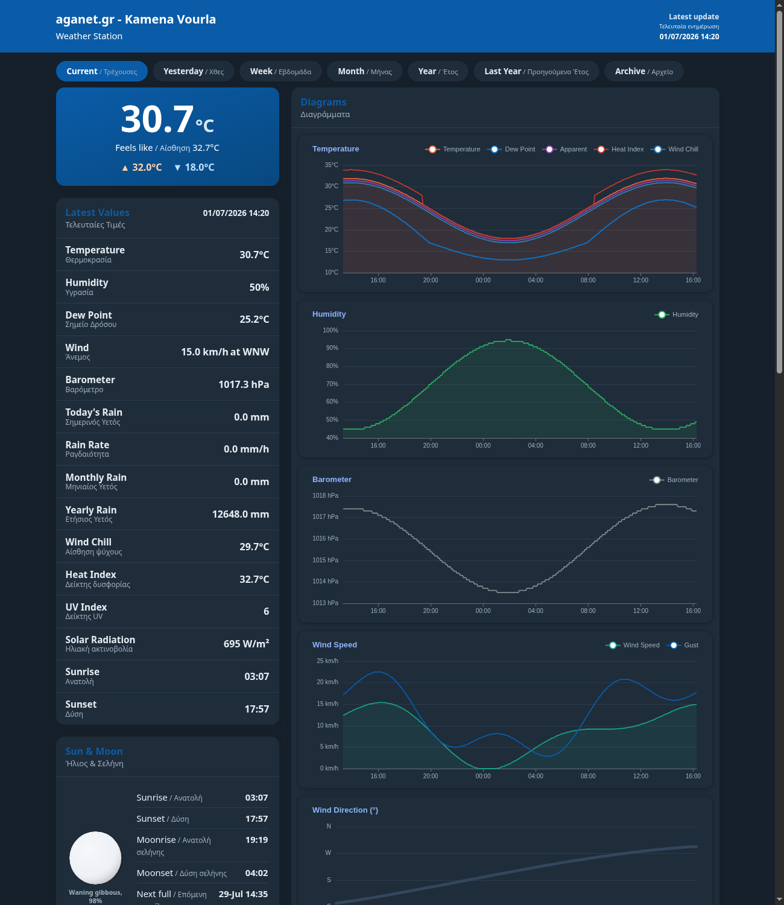

# AganetWX, a WeeWX skin

A weather dashboard skin for [WeeWX](https://weewx.com) 5.x. There are several
great skins out there, but I wanted the exact layout and data I had in mind, so
I gave making my own a try. Interactive charts, a page per time period, it shows
whatever sensors you have, and it translates. Everything is set in `weewx.conf`;
you never edit a template.

Source and releases: [github.com/aganet/weewx-aganetwx](https://github.com/aganet/weewx-aganetwx)

Live demo: [aganet.gr](https://aganet.gr)



<details>
<summary>Classic layout and dark mode (each one config line)</summary>

`layout = classic` switches to a warm, compact label-row look:



`mode = dark`:


</details>

---

## Highlights

- Seven pages behind a top nav: Current, Yesterday, Week, Month, Year, Last Year, Archive (plus About).
- An interactive chart per metric, drawn with [Apache ECharts](https://echarts.apache.org/) (self-hosted, no CDN): temperature and its friends (dew point, apparent, heat index, wind chill), humidity, barometer, wind speed and gust, wind direction, wind rose, rain, UV, solar radiation, evapotranspiration and cloud base.
- A current-conditions hero with the big temperature, feels-like and today's high/low. By default it tints by temperature, ice-blue when freezing through to deep red when hot, and shows a little weather-mood face with a one-word caption (Brrr! ... Perfect ... Melting!). Turn either off if you prefer.
- Trend arrows (rising / steady / falling) next to temperature, humidity and UV, and a 3-hour pressure tendency under the barometer.
- Threshold highlighting: give a value a high/low limit and its row lights up red or blue when it crosses. Ships with defaults tuned for a warm climate; change them in `weewx.conf`.
- An all-time records card: the highest and lowest temperature, wind gust, humidity, barometer and rain rate in your archive, each with the date it happened. There's also a "last rain" line.
- A "today in one sentence" summary in plain language, built from the station's own data, with active weather alerts (heat, frost, strong wind, heavy rain, high UV, humidity) appended when today crosses your thresholds. On by default.
- A "compared to the past" card: today vs yesterday, this month's rain vs the same month in prior years, and today vs this date last year, all from your own archive. Off by default; richer with more history.
- An optional History page (own nav tab): overlay any metric across every year in your archive, either day-by-day for a chosen month or across all twelve months of each year, to see which years ran hot, wet or windy. Pick years with checkboxes; each year has its own colour (shown as a swatch) and the newest is drawn bold. Off by default.
- A stale-data banner when the station goes quiet for over an hour (configurable). It runs in the browser off an absolute timestamp, so it still shows if report generation has stopped, and it is right in any visitor's timezone.
- Sensor-agnostic. It discovers whatever your station records, extra temperature and humidity channels, soil, leaf, air quality, lightning, battery, with no hardcoded list, so it looks complete on a Davis, an Ecowitt, a Tempest, or a bare thermometer.
- Theming from `weewx.conf`: colours, gradient, font, density, and light / dark / auto mode. A header switcher lets visitors flip between Modern, Classic and Dark, and their choice sticks.
- Seven languages built in (English, Greek, Spanish, French, German, Italian, Portuguese), with a header dropdown that relabels the whole page, charts included, without a reload. The browser language is picked on the first visit. Adding one is a single `lang/<code>.conf` file, no template edits.
- NOAA monthly and yearly reports, linked from the Archive page.
- An About page that reads the station hardware, coordinates, altitude and software versions on its own, plus your own prose and contact fields. One toggle hides the exact coordinates.
- An optional webcam banner above the nav on the Current page. It only reloads the image when the frame actually changed (or stays static), shows a countdown, and opens full-size in a lightbox on click. Size, position and a click-through link are yours to set.
- A "Useful Links" card, a few external links (a lightning map, Windy, a satellite view; Greek by default) you edit in config.
- An optional HF propagation card for radio amateurs: solar flux, sunspots, A- and K-index, and a colour-coded band-conditions table from HamQSL. Off unless you turn it on.
- It follows your WeeWX units (us, metric or metricwx) and timezone rather than imposing its own, so every value, axis and label matches the rest of your setup. Override per-report if you want this one page to differ.

## Requirements

- WeeWX **5.x** (Python 3).
- No external services. Charts and all assets are self-hosted.

## Install

Install straight from the latest release (no download step needed):

```bash
sudo weectl extension install https://github.com/aganet/weewx-aganetwx/releases/latest/download/AganetWX-1.8.11.zip
sudo systemctl restart weewx          # or: sudo /etc/init.d/weewx restart
```

Or, if you already downloaded the zip, point at its full path:

```bash
sudo weectl extension install /path/to/AganetWX-1.8.11.zip
```

This adds a `[[AganetWXReport]]` report under `[StdReport]`, installs the skin to
`skins/AganetWX`, and the sensor-discovery helper to `bin/user/aganetwx_extras.py`.
Output lands in `public_html/aganetwx/`; browse to `.../aganetwx/`.

### Running alongside another skin

WeeWX runs every enabled report under `[StdReport]`, so AganetWX can sit next to
your existing skin instead of replacing it. It writes to its own subfolder
(`HTML_ROOT = aganetwx`), so nothing collides: your current skin stays at its
usual address and AganetWX appears at `.../aganetwx/`. To make it primary
instead, set `HTML_ROOT` to your site root. To turn it off without uninstalling,
set `enable = false` in `[[AganetWXReport]]`.

### Uninstall

```bash
weectl extension uninstall AganetWX
```

## Configuration

Everything is optional. Defaults live in `skins/AganetWX/skin.conf`; override any of
them per-report in `weewx.conf` under `[StdReport] [[AganetWXReport]]` - **without
touching a template**.

> **Put your settings in `weewx.conf`, not in `skin.conf`.** An extension update
> overwrites `skin.conf`, so edits there are lost on the next upgrade. Values in
> `weewx.conf` are never touched by updates and take precedence over the skin
> defaults. Mirror the `[[[Extras]]]` structure under `[[AganetWXReport]]`.

Example:

```ini
[StdReport]
    [[AganetWXReport]]
        skin = AganetWX
        HTML_ROOT = aganetwx
        lang = en                     # default language (en el es fr de it pt)
        # unit_system inherited from your WeeWX config; set here only to differ.

        [[[Extras]]]
            languages = en, el, es, fr, de, it, pt  # in-page switcher
            extra_sensors = true      # auto-discovered sensors panel

            [[[[theme]]]]
                layout = modern       # classic (compact rows) | modern (card tiles)
                mode = dark           # light | dark | auto
                accent = "#00d8ff"
                gradient_top = "#243447"
                gradient_bottom = "#1a2531"
                font = "Verdana, Geneva, sans-serif"
                density = compact     # comfortable | compact

            [[[[nav]]]]               # show/hide period tabs
                lastyear = false
                archive = true

            [[[[charts]]]]            # show/hide individual charts
                cloudbase = false

            [[[[rows]]]]              # show/hide Current-Values rows
                heatindex = false

            [[[[branding]]]]
                show_footer_coords = true
                link_url = "https://example.com"
                link_text = "My site"
```

### Config reference

| Setting | Values | Default | Effect |
|---|---|---|---|
| `lang` | `en`,`el`,`es`,`fr`,`de`,`it`,`pt` | `en` | Server-rendered default language (loads `lang/<code>.conf`) |
| `unit_system` | `us`,`metric`,`metricwx` | (inherited) | Optional per-report override; by default follows your WeeWX config |
| `Extras.languages` | code list | all 7 | Languages in the in-page switcher; single code hides it |
| `Extras.extra_sensors` | bool | `true` | Auto-discovered extra-sensor panel |
| `Extras.extra_sensor_groups` | group list | all | Limit which sensor groups show in that panel, in order (`temp`,`humidity`,`soil`,`leaf`,`air`,`lightning`,`other`,`status`); empty shows all |
| `Extras.temp_chart_series` | obs list | default | Which series the Temperature chart draws, in order, incl. extra sensors (e.g. `outTemp, extraTemp2`); empty = default set |
| `Extras.hero` | bool | `true` | Current-conditions hero card (Current page) |
| `Extras.summary` | bool | `true` | "Today in one sentence" plain-language summary with active weather alerts (Current page) |
| `Extras.compare` | bool | `false` | "Compared to the past" card: vs yesterday, vs the monthly average, vs this date last year (Current page) |
| `Extras.compare_page` | bool | `false` | History page (own nav tab): overlay a metric across every year, day-by-day for a chosen month |
| `Extras.compare_refresh` | seconds | `86400` | How often the History page's whole-archive aggregation is rebuilt (cached on disk) |
| `Extras.celestial` | bool | `true` | Sun and Moon card |
| `Extras.disclaimer` | bool | `true` | Amateur-station disclaimer in the footer |
| `Extras.auto_refresh` | `auto`,seconds,`off` | `auto` | Auto-reload the page to follow new data |
| `Extras.stale_alert_secs` | seconds | `3600` | Warn (banner) when the latest observation is older than this; `0` disables |
| `Extras.chart_tz` | IANA zone | auto | Timezone for chart-time labels (e.g. `Europe/Athens`); empty auto-detects from the server. Set it if charts are offset for visitors in another timezone |
| `theme.layout` | `modern`,`classic` | `modern` | flat card-tile dashboard vs. compact rows |
| `theme.mode` | `light`,`dark`,`auto` | `light` | `auto` follows the visitor's OS preference |
| `theme.switcher` | bool | `true` | Header dropdown to switch Modern/Classic/Dark (remembered per browser) |
| `theme.hero_dynamic_color` | bool | `true` | Tint the hero by temperature: ice-blue when freezing, blue when mild, amber to deep red when hot |
| `theme.hero_mood` | bool | `true` | Weather-mood face + caption in the hero (Brrr! to Melting!) |
| `theme.accent` | CSS color | `#0a5ca8` | Chart titles, links, headings |
| `theme.gradient_top` / `gradient_bottom` | CSS color | gold/cream | Header and panel gradient |
| `theme.page_bg` | CSS color | `#FFFDCA` | Page background |
| `theme.font` | CSS font stack | Verdana | Body font |
| `theme.density` | `comfortable`,`compact` | `comfortable` | Row and chart sizing |
| `nav.<tab>` | bool | `true` | Show/hide a tab (`current`,`yesterday`,`week`,`month`,`year`,`lastyear`,`archive`,`about`) |
| `charts.<metric>` | bool | `true` | Show/hide a chart (`temp`,`humidity`,`pressure`,`windspeed`,`windvec`,`windvector`,`windrose`,`rain`,`rainrate`,`uv`,`radiation`,`et`,`cloudbase`) |
| `rows.<row>` | bool | `true` | Show/hide a Current-Values row (`humidity`,`dewpoint`,`wind`,`barometer`,`rain_today`,`rain_rate`,`rain_month`,`rain_year`,`last_rain`,`et`,`windchill`,`heatindex`,`apptemp`,`uv`,`radiation`) |
| `Extras.rows_show_range` | bool | `true` | Today's high/low (with time) beside each current value |
| `Extras.records` | bool | `true` | All-time records card (below Today's Hi/Lows) |
| `Extras.solar` | bool | `false` | HF propagation card (HamQSL solar data + band conditions) |
| `Extras.solar_timeout` | seconds | `15` | Timeout for the server-side HamQSL fetch |
| `alerts.<obs>.high` / `.low` | number | Greek-climate defaults | Highlight a Current-Values row when the value crosses this limit (in your displayed units); defaults set for temp, apparent temp, wind, humidity, rain rate, UV |
| `about.prose_en` / `prose_el` | string | empty | About-page description (inline HTML ok) |
| `about.operator` / `website_url` / `website_text` / `email` | string | empty | About-page contact fields |
| `about.hardware` | string | empty | Override the hardware label (else WeeWX's value) |
| `about.show_coordinates` | bool | `true` | Show exact coords and map link on About; `false` for privacy |
| `branding.show_footer_coords` | bool | `true` | Lat/long/altitude in footer |
| `branding.link_url` / `link_text` | string | empty | Optional footer link |
| `links.show` | bool | `true` | Show the "Useful Links" card (bottom of the left column) |
| `links.<entry>` | `url`,`text` | Greece maps | Each `[[[entry]]]` adds a link; edit/add/remove freely |
| `webcam.enable` | bool | `false` | Show the webcam banner above the nav |
| `webcam.url` | string | `cam.jpg` | Image path (relative to the site) or full URL |
| `webcam.auto_refresh` | bool | `true` | Reload the image periodically (cache-busted) with a live countdown badge; `false` for a static image |
| `webcam.refresh` | seconds | `30` | Refresh interval when `auto_refresh` is on |
| `webcam.max_width` | px | empty | Cap the image width; empty = full content width |
| `webcam.height` | px | `380` | Cap the display height |
| `webcam.align` | `left`,`center`,`right` | `center` | Position a narrower image |
| `webcam.title` / `link` | string | empty | Optional caption and click-through URL |

### Units

The skin follows your WeeWX `unit_system` (`us`, `metric`, or `metricwx`) and
does not override it. The metric systems differ: `metric` uses km/h + cm + mbar,
`metricwx` uses m/s + mm + mbar. For the everyday km/h + mm + hPa combo, set the
individual groups in your WeeWX config (not the skin):

```ini
[StdReport]
    [[Defaults]]
        unit_system = metric
        [[[Units]]]
            [[[[Groups]]]]
                group_rain = mm
                group_rainrate = mm_per_hour
                group_pressure = hPa
```

## Threshold highlighting

Give any current value high/low limits and its row lights up when it crosses
them (red above `high`, blue below `low`). Limits are in your displayed units.
The skin ships with sensible defaults for a warm Mediterranean/Greek climate
(temperature, apparent temperature, wind, humidity, rain rate, UV); override or
remove them for your own climate by editing the `[[[[alerts]]]]` block in
`weewx.conf` (delete a subsection to stop highlighting that value).

```ini
[StdReport]
    [[AganetWXReport]]
        [[[Extras]]]
            [[[[alerts]]]]
                [[[[[outTemp]]]]]
                    high = 38
                    low = 0
                [[[[[windSpeed]]]]]
                    high = 55
                [[[[[outHumidity]]]]]
                    high = 90
```

Alerts work for any observation shown in Current Values (for example `outTemp`,
`outHumidity`, `dewpoint`, `windSpeed`, `barometer`).

## All-time records

An "All-Time Records" card (below Today's Hi/Lows on the Current page) shows the
highest and lowest values ever recorded in your archive, with the date each
happened: temperature, wind gust, humidity, barometer and rain rate. Set
`Extras.records = false` to hide it. The current temperature, humidity and UV
rows also show a small rising / steady / falling trend arrow, and a "Last Rain"
row shows when it last rained and how many days ago.

## Today in one sentence

A plain-language summary near the top of the Current page, e.g. "A warm day so
far. High so far 32.5C, gusts to 25.7 km/h, no rain yet.", built entirely from
this station's own data. The wording says "so far" because it reflects
midnight until now, not a finished day.

When today's own extremes cross the limits you set in `[[alerts]]` (the same
limits used for row highlighting), a short alert is appended to the sentence,
for example "Strong wind, gusts to 55 km/h." or "Extreme heat 38.4C.". Covered:
heat, frost, strong wind, heavy rain, very high UV and very high humidity.

On by default. Turn it off with:

```ini
[StdReport]
    [[AganetWXReport]]
        [[[Extras]]]
            summary = false
```

## Compared to the past

An optional card that puts today in context using your own archive:

- **vs yesterday**, the temperature difference at the same time of day (a fair
  like-for-like, not today-so-far against a whole day).
- **vs this date last year**, how today's high compares with the same calendar
  date a year ago. A single-day curiosity, not a climate trend.
- **vs a typical month so far**, this month's average temperature and its
  rainfall total against the same month up to the same day and time in previous
  years (needs at least two prior years).

Every comparison is like-for-like (each year cut at the same point of the
month). The more history your archive holds, the more appears; each line is
hidden when there is not enough data. Off by default:

```ini
[StdReport]
    [[AganetWXReport]]
        [[[Extras]]]
            compare = true
```

## History page

An optional page (its own **History** tab) for exploring your whole archive: it
overlays a chosen metric across every year, day-by-day for a chosen month, so
you can see at a glance which Julys were hottest or which winters were wettest.

A toggle at the top picks the view. "By month" overlays a chosen month day by
day; "Whole year" overlays all twelve months, one line per year, where rain is
the monthly total and every other metric the monthly average. Pick the metric
(temperature, rain, wind, humidity, pressure, UV, solar radiation) from a
dropdown, and tick the years to show (with All / None buttons). Each year has
its own distinct colour, shown as a swatch next to its checkbox, so you can map
any line to its year at a glance; the most recent year is also drawn bold.

It aggregates the whole archive, so the result is cached on disk and rebuilt
only once a day by default (set `compare_refresh` in seconds), which keeps
report generation fast even on many years of data. Off by default:

```ini
[StdReport]
    [[AganetWXReport]]
        [[[Extras]]]
            compare_page = true
            compare_refresh = 86400
```

## Choosing sensors and temperature-chart series

Two settings let you tailor what shows without editing any template:

- `extra_sensor_groups` limits the Extra Sensors panel to the groups you list,
  in order, e.g. `extra_sensor_groups = temp` for temperatures only. Empty shows
  every group that was discovered.
- `temp_chart_series` sets exactly which series the Temperature chart draws, in
  order, and can include your own extra temperature sensors. For example
  `temp_chart_series = outTemp, extraTemp2` compares outside air with a soil
  probe. Empty keeps the default set (outTemp, dewpoint, apparent, heat index,
  wind chill).

```ini
[StdReport]
    [[AganetWXReport]]
        [[[Extras]]]
            extra_sensor_groups = temp
            temp_chart_series = outTemp, extraTemp2
```

## Languages

English, Greek, Spanish, French, German, Italian and Portuguese ship complete
(`en`, `el`, `es`, `fr`, `de`, `it`, `pt`). Every word, including chart labels,
lives only in `lang/<code>.conf`.

**In-page language switcher.** List the languages you want in `Extras.languages`
(default: all seven). The header then shows a language dropdown: visitors pick
their language and every label and chart relabels instantly, with no page
reload. The browser language is auto-selected on the first visit and the choice
is remembered (localStorage). All languages ride in one build (a small strings
dictionary per language, a few KB each), so there is no duplicated per-language
output. Set `lang = <code>` for the server-rendered default and fallback; leave
`Extras.languages` with a single code to pin one language and hide the switcher.

To add a language:

1. Copy `skins/AganetWX/lang/en.conf` to `skins/AganetWX/lang/<code>.conf`.
2. Translate the right-hand side of each entry under `[Texts]` and
   `[Labels][[Generic]]` (keep the left-hand keys in English). Any entry left
   untranslated falls back to English.
3. Add `<code>` to `Extras.languages` (and/or set `lang = <code>`).

No template editing. PRs adding languages are welcome.

Note on SEO: the switcher swaps labels client-side, so crawlers index the
server-rendered `lang`. For a weather station that is fine (the searchable
content, station name and location, is identical in every language). If you need
each language separately crawlable, generate one report per language into its
own folder with `hreflang` alternates instead.

## Customizing the About page

The About page shows station facts automatically and takes prose/contact from
`[Extras][[about]]`. For richer content, copy `skins/AganetWX/about.inc.example`
to `about.inc` in the same directory: when present it replaces the config prose,
accepts full HTML, and expands WeeWX tags like `$station.hardware`. Delete it to
fall back. Set `about.show_coordinates = false` to hide exact coordinates.

## Webcam

Enable a webcam banner above the navigation on the Current page (aligned to the
content width, off by default):

```ini
[StdReport]
    [[AganetWXReport]]
        [[[Extras]]]
            [[[[webcam]]]]
                enable = true
                url = "cam.jpg"       # local file or full URL
                auto_refresh = true   # reload periodically, cache-busted
                refresh = 30          # seconds
                max_width = ""        # px; empty = full content width
                height = 380          # px
                align = center        # left | center | right
                title = ""            # optional caption
                link = ""             # optional click-through URL
```

With `auto_refresh = true` the image is checked every `refresh` seconds and
reloaded only when the frame actually changed (a lightweight `Last-Modified`
check, so identical frames are not re-downloaded), with a live "Refreshing in
Ns" countdown badge. Set `auto_refresh = false` for a static image. Clicking the
image opens it full-size in a lightbox (unless a click-through `link` is set);
close with Escape, a click on the backdrop, or the close button. On phones the
banner runs edge to edge. If a frame fails to load the banner doesn't panic: it
keeps the last good image, retries, and comes back on its own once the camera
does, so a brief network hiccup won't leave you staring at a gap.

Both the webcam refresh and the whole-page auto-reload **stop after about 60
minutes** so a forgotten, idle tab does not keep polling; the webcam badge then
shows "Paused". Reloading the page starts a fresh 60-minute session.

## Useful Links card

A "Useful Links" card sits at the bottom of the left column with external links
(a lightning map, Windy, and a satellite view, defaulting to Greece-wide maps).
Edit, add, remove, or hide them from `weewx.conf`, no template editing:

```ini
[StdReport]
    [[AganetWXReport]]
        [[[Extras]]]
            [[[[links]]]]
                show = true
                [[[[[lightning]]]]]
                    text = "Lightning map"
                    url = "https://www.lightningmaps.org/"
                [[[[[windy]]]]]
                    text = "Windy"
                    url = "https://www.windy.com/"
```

Each `[[[[[entry]]]]]` needs a `url` and `text`; order is the display order. Set
`show = false` to hide the card.

## HF propagation card

An optional card for amateur-radio operators showing current solar-terrestrial
conditions: solar flux, sunspot number, A-index, K-index, and a colour-coded HF
band-conditions table (80m-40m, 30m-20m, 17m-15m, 12m-10m; day and night;
Good/Fair/Poor). Data comes from [HamQSL](https://www.hamqsl.com) (N0NBH).

It is fetched server-side once per report cycle, so the generated page makes no
client-side external request. The last good reading is cached, so a temporary
fetch failure reuses it; the card stays hidden until the first successful fetch.
It is off by default:

```ini
[StdReport]
    [[AganetWXReport]]
        [[[Extras]]]
            solar = true
            solar_timeout = 15
```

## Troubleshooting

**Charts don't show up.** Load the page through your web server
(`http://.../aganetwx/`), not by double-clicking the HTML file. The charts pull
their data with `fetch()`, and browsers refuse that on a `file://` URL. If they
are still missing over HTTP, open the browser console: an error on
`data/<period>.json` means the server isn't serving the `data/` folder (wrong
path, or the wrong MIME type).

**A sensor shows the wrong unit** (a temperature reading as `%`, say, or a value
with no unit at all). The skin prints whatever unit group WeeWX has attached to
that reading, so a wrong unit means the reading is filed under the wrong group
in WeeWX itself, not here. WeeWX 5.x still can't set that from `weewx.conf`, so
you fix it with a small service. Drop this in `bin/user/fix_groups.py`:

```python
import weewx.units
from weewx.engine import StdService

class FixGroups(StdService):
    def __init__(self, engine, config_dict):
        super().__init__(engine, config_dict)
        weewx.units.obs_group_dict['extraTemp2'] = 'group_temperature'
```

then tell WeeWX to load it:

```ini
[Engine]
    [[Services]]
        prep_services = weewx.engine.StdTimeSynch, user.fix_groups.FixGroups
```

Restart WeeWX and the value comes back as a temperature. Pick the group that
matches the sensor: `group_temperature`, `group_percent`, `group_moisture`, and
so on.

## How it works

- **Pages** are thin templates that include shared partials (`_head.inc`,
  `_nav.inc`, `_periodbody.inc`, `_foot.inc`); each sets its WeeWX period binder.
- **Charts** read per-period JSON the skin writes each report cycle
  (`data/<period>.json`), rendered client-side by `aganetwx.js` + `lib/echarts.min.js`.
- **Extra sensors** come from a Search List Extension (`user/aganetwx_extras.py`)
  that inspects the archive schema/record at generation time.
- **Theme** variables are injected into `:root` from config by `_head.inc`; the
  CSS is fully variable-driven, so a config change re-skins everything.

## License

AganetWX is a skin for [WeeWX](https://weewx.com), released under the GNU GPL v3.
Bundled [Apache ECharts](https://echarts.apache.org/) is under the Apache-2.0
license.
